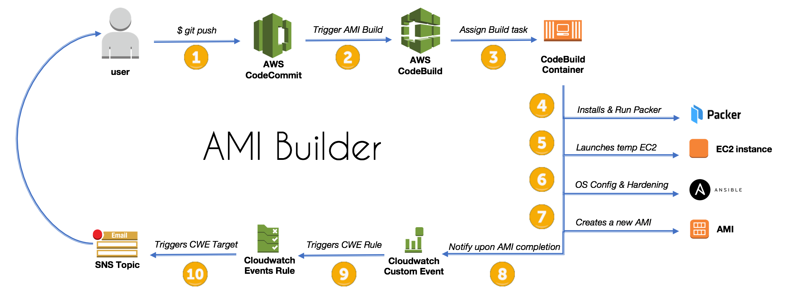
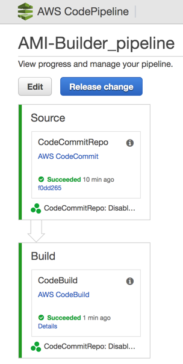

## Purpose

This Packer AMI Builder creates a new AMI out of the latest Amazon Linux AMI, and also provides a cloudformation template that leverages AWS CodePipeline to 
orchestrate the entire process.



## Source code structure

```bash
├── ansible
│   ├── playbook.yaml                       <-- Ansible playbook file
│   ├── requirements.yaml                   <-- Ansible Galaxy requirements containing additional Roles to be used (CIS, Cloudwatch Logs)
│   └── roles
│       ├── common                          <-- Upgrades all packages through ``yum``
├── buildspec.yml                           <-- CodeBuild spec 
├── cloudformation                          <-- Cloudformation to create entire pipeline
│   └── pipeline.yaml
├── packer_cis.json                         <-- Packer template for Pipeline
```


## Cloudformation template

Cloudformation will create the following resources as part of the AMI Builder for Packer:

* ``cloudformation/pipeline.yaml``
    + AWS CodeCommit - Git repository
    + AWS CodeBuild - Downloads Packer and run Packer to build AMI 
    + AWS CodePipeline - Orchestrates pipeline and listen for new commits in CodeCommit
    + Amazon SNS Topic - AMI Builds Notification via subscribed email
    + Amazon Cloudwatch Events Rule - Custom Event for AMI Builder that will trigger SNS upon AMI completion


## HOWTO

**Before you start**

* Install [GIT](https://git-scm.com/downloads) if you don't have it
* Make sure AWS CLI is configured properly
* [Configured AWS CLI and Git](http://docs.aws.amazon.com/codecommit/latest/userguide/setting-up-https-unixes.html) to connect to AWS CodeCommit repositories

**Launch the Cloudformation stack**

Region | AMI Builder Launch Template
------------------------------------------------- | ---------------------------------------------------------------------------------
N. Virginia (us-east-1) | [](https://console.aws.amazon.com/cloudformation/home?region=us-east-1#/stacks/new?stackName=AMI-Builder-Blogpost&templateURL=https://s3-eu-west-1.amazonaws.com/ami-builder-packer/cloudformation/pipeline.yaml)
Ireland (eu-west-1) | [](https://console.aws.amazon.com/cloudformation/home?region=eu-west-1#/stacks/new?stackName=AMI-Builder-Blogpost&templateURL=https://s3-eu-west-1.amazonaws.com/ami-builder-packer/cloudformation/pipeline.yaml)
London (eu-west-2) | [](https://console.aws.amazon.com/cloudformation/home?region=eu-west-2#/stacks/new?stackName=AMI-Builder-Blogpost&templateURL=https://s3-eu-west-1.amazonaws.com/ami-builder-packer/cloudformation/pipeline.yaml)

**To clone the AWS CodeCommit repository (console)**

1.  From the AWS Management Console, open the AWS CloudFormation console.
2.  Choose the AMI-Builder-Blogpost stack, and then choose Output.
3.  Make a note of the Git repository URL.
4.  Use git to clone the repository.
For example: git clone https://git-codecommit.eu-west-1.amazonaws.com/v1/repos/AMI-Builder_repo

**To clone the AWS CodeCommit repository (CLI)**

```bash
# Retrieve CodeCommit repo URL
git_repo=$(aws cloudformation describe-stacks --query 'Stacks[0].Outputs[?OutputKey==`GitRepository`].OutputValue' --output text --stack-name "AMI-Builder-Blogpost")

# Clone repository locally
git clone ${git_repo}
```

Next, we need to copy all files in this repository into the newly cloned Git repository:

* Download [ami-builder-packer ZIP](https://github.com/awslabs/ami-builder-packer/archive/master.zip).
* Extract and copy the contents to the Git repo

Lastly, commit these changes to your AWS CodeCommit repo and watch the AMI being built through the AWS CodePipeline Console:

```bash
git add .
git commit -m "SHIP THIS AMI"
git push origin master
```



## Known issues

* ~~Currently, Packer doesn't work with ECS IAM Roles (also used by CodeBuild)~~
    - ~~That's why we build a credentials file that leverages temporary credentials in the ``buildspec``~~
    - ~~When Packer supports this feature, this will no longer be necessary~~
* If Build process fails and within AWS CodeBuild Build logs you find the following line ``Timeout waiting for SSH.``, it means either
    - A) You haven't chosen a VPC Public Subnet, and therefore Packer cannot connect to the instance
    - B) There may have been a connectivity issue between Packer and EC2; retrying the build step within AWS CodePipeline should work just fine 

